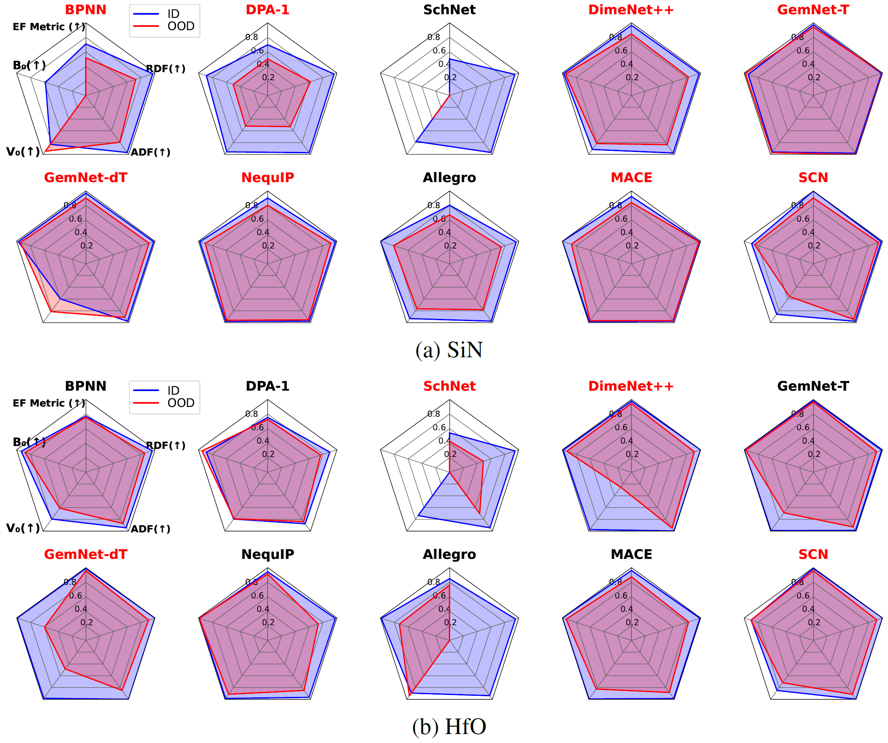

# MLFF Framework

## Overview 

This repository provides a framework to train and evaluate models for machine learning force fields (MLFF).
Machine learning force fields (MLFF) have gained significant attention as a candidate for large-scale molecular dynamics (MD) simulations.
MLFF aims to achieve the precision comparable to DFT-based simulations and relieve their computational cost.

Additionally, in this repository, two rich datasets for important semiconductor thin film materials silicon nitride (SiN) and hafnium oxide (HfO) are introduced to foster the development of MLFF for the semiconductors.
We conducted DFT simulations with various conditions that include initial structures, stoichiometry, temperature, strain, and defects, resulting in the cost of 2.6k GPU days.
Even so, the MD simulations exhibit an enormously wide range of atomic configurations with high degree of freedom.
Hence, to properly evaluate simulation performance of MLFF models, it is important to assess extrapolation capability to yield reliable predictions for configurations that are absent from the training dataset.
To this end, we employ the evaluation for out-of-distribution datasets.

To start off, we present the experimental benchmark results of 10 MLFF models evaluated using six metrics, out of which five consider the simulation performance.
It is with great joy that we can announce the acceptance of our paper ["Benchmark of Machine Learning Force Fields for Semiconductor Simulations: Datasets, Metrics, and Comparative Analysis"](https://neurips.cc/virtual/2023/poster/73500) into **NeurIPS 2023 Datasets and Benchmark Track**.  

<p align="center">
    
</p>

## Datasets

### Download

Our semiconductor datasets (SiN and HfO) can be downloaded from the following links.
* [SiN (raw).tar](https://drive.google.com/file/d/1umhok3RbYyjjnpeKkxEGJUN2oY3OxSBN/view?usp=sharing)
* [SiN.tar](https://drive.google.com/file/d/1l9nsie40Bpm8CNW4sx94yAuvmMkUfM3b/view?usp=sharing)
* [HfO (raw).tar](https://drive.google.com/file/d/1tSkjfp4N8cvHqpFYYlu2EqK8u2HRIro7/view?usp=sharing)
* [HfO.tar](https://drive.google.com/file/d/1-DVMGyXjvNYaBtaAkWu8uQVgvz8pEgMZ/view?usp=sharing)

The two raw files consist of all the snapshots observed in DFT-based simulation run by VASP. 
The others include snapshots sampled from the raw files according to the rule described in our paper.
In this benchmark, models were trained by using these two files, `SiN.tar` and `HfO.tar`.

Anyway, **welcome the feedback about the dataset split and any insight of our rich semiconductor datasets**.

```
# extract tar files at the datasets directory
cd datasets
tar xf SiN.tar
tar xf HfO.tar

# optional
rm SiN.tar
rm HfO.tar
```

The extracted dataset files have the extended-xyz format, whose file extension is `.xyz`.

### Preprocesing 

After installing the framework as below, data preprocessing is available.  
As in [OCP](https://github.com/Open-Catalyst-Project/ocp), datasets should be `.lmdb` when training models.  
[This link](scripts/preprocess_data/) provides how to convert the `.xyz` into `.lmdb`.

## How to Use the Framework

First, we explain about how to set up the environment for this framework, and then give guidelines to operate five functionals through `main.py`, named `fit-scale`, `train`, `validate`, `run-md`, and `evaluate`.
For using more arguments of these functionals, it would be helpful to see `scripts/` and `configs/`.

### 1. Installation

After following the instructions below, users can install the framework and perform MLFF benchmarks.

```
git clone https://github.com/SAITPublic/MLFF-Framework.git
cd MLFF-Framework
```

From now on, the base working directory is the inside of `MLFF-Framework/`.

By the following instructions, the packages related to MLFF models and MD simulation are downloaded (git clone).

```
git submodule init
git submodule update
```

We modify [OCP](https://github.com/Open-Catalyst-Project/ocp) and [auto-FOX](https://github.com/nlesc-nano/auto-FOX), which are located in `codebases/`, with minor modifications.  
To enable users apply the modifications, we provide [two patch files](codebases/patches/) and the following instructions.  

```
# auto-FOX
cd codebases/auto-FOX
git apply ../patches/auto-FOX-custom.patch
pip install .

# OCP
cd ../ocp
git apply ../patches/ocp-scn-custom.patch
```

<!-- By the instructions, it is not mandatory to use `pip install` for installing MLFF packages required by MLFF-Framework. -->

*Note* : Any other MLFF package can be compatible with our framework if some requirements are satified as follows.
* The wrapper for models supported by the package should be implemented (see `src/common/models`).
* If the package is located at `codebases/`, `sys.path` should include its path (see `main.py`).
* If data format used by models is different from that of [OCP](https://github.com/Open-Catalyst-Project/ocp), data that is loaded from `.lmdb` (prepared by our script) should be converted into the data format of the package (see `src/common/collaters/`).
* If some training conditions need to be handled, a tailored trainer class should be implemented (see `src/common/trainers/`)


### 2. Training MLFF Models

Before training and validating models, please prepare `.lmdb` files.
For detailed guidlines, please refer to the links provided below.

* [Fit scale](scripts/fit_model_scale_factors/) (optional for GemNet)
* [Train](scripts/train/) 
* [Validate](scripts/validate/)


### 3. Evaluating Trained Models

After training models, users can evaluate the models through our six metrics described in our paper, which are important to appropriately evaluate the performance of models in the simulations: errors of energy and force prediction, radial distribution function, angular distribution function, bulk modulus, equilibrium volume, and potential energy curves.

* [Evaluate Prediction Performance of Energy and Force](scripts/evaluate/README.md#evaluate-errors-of-energy-and-forces)
: The functionality is same with the `Validate`, but the extended-xyz format (`.xyz`) is used as input and the snapshots are inferred one-by-one.
* [Run MD simulation](scripts/simulate/)
* [Evaluate using Simulation Indicators](scripts/evaluate/)


### 4. Helpful Scripts For NequIP and Allegro

[Materials Intelligence Group at Harvard University](https://github.com/mir-group) provides the pair codes for NequIP and Allegro to be compatible with LAMMPS, one of the most popular MD simulation tools. 
To prepare the pair from the trained models of NequIP and Allegro through the framework, we provide some helpful scripts.

* [Deploy the checkpoint for LAMMPS](scripts/deploy_model_for_LAMMPS/)
* [Activate or deactivate stress prediction in the checkpoint](scripts/convert_btw_force_stress/)

## Acknowledge and Reference Code

OCP [github](https://github.com/Open-Catalyst-Project/ocp)   
NequIP [github](https://github.com/mir-group/nequip)   
Allegro [github](https://github.com/mir-group/allegro)  
MACE [github](https://github.com/ACEsuit/mace)  
SIMPLE-NN [github](https://github.com/MDIL-SNU/SIMPLE-NN_v2)   


## Citing Our Datasets and MLFF Framework

If you use these datasets and/or this repository for research purposes, please cite our work as follows:

```
@article{sait_mlff_framework_sin_hfo,
    title = {Benchmark of Machine Learning Force Fields for Semiconductor Simulations: Datasets, Metrics, and Comparative Analysis},
    author = {Geonu Kim, Byunggook Na, Gunhee Kim, Hyuntae Cho, Seungjin Kang, Hee Sun Lee, Saerom Choi, Heejae Kim, Seungwon Lee, Yongdeok Kim},
    journal = {Advances in Neural Information Processing Systems},
    year = {2023},
}
```